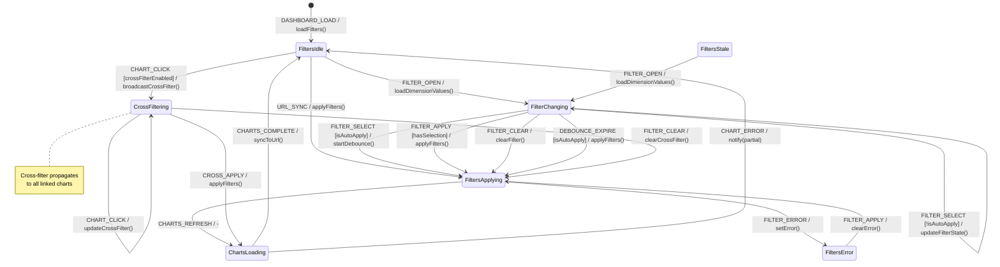

# Dashboard Filtering FSM

**Source**: `infra/superset/superset_config.py`, Superset Native Filters

## Overview

State machine for dashboard filter interactions in embedded Superset dashboards, including native filters, cross-filtering, and URL-based filter sync.

## States

| State | Description |
|-------|-------------|
| `FiltersIdle` | Filters loaded, no pending changes |
| `FilterChanging` | User modifying filter value |
| `FiltersApplying` | Filter change being applied to charts |
| `ChartsLoading` | Charts re-querying with new filters |
| `FiltersError` | Filter application failed |
| `FiltersStale` | Filter values outdated (dimension changed) |
| `CrossFiltering` | Cross-filter from chart interaction |

## Events

| Event | Source | Description |
|-------|--------|-------------|
| `FILTER_OPEN` | User | Filter dropdown opened |
| `FILTER_SELECT` | User | Filter value selected |
| `FILTER_CLEAR` | User | Filter cleared |
| `FILTER_APPLY` | User/System | Apply button or auto-apply |
| `CHARTS_REFRESH` | System | Charts finished loading |
| `CHART_CLICK` | User | Click on chart element (cross-filter) |
| `URL_SYNC` | System | Filter params from URL applied |
| `FILTER_ERROR` | System | Filter query failed |
| `DIMENSION_CHANGE` | System | Underlying dimension values changed |
| `DEBOUNCE_EXPIRE` | System | Filter input debounce timer |

## Guards

| Guard | Condition |
|-------|-----------|
| `hasSelection` | Filter has selected values |
| `isAutoApply` | Dashboard configured for auto-apply |
| `debounceActive` | Debounce timer running |
| `crossFilterEnabled` | Dashboard has cross-filtering enabled |
| `filtersValid` | Selected values exist in dimension |

## Side Effects

| Action | Description |
|--------|-------------|
| `updateFilterState` | Update filter component state |
| `applyFilters` | Trigger chart refresh with filters |
| `syncToUrl` | Update URL query params |
| `loadDimensionValues` | Fetch filter dropdown options |
| `broadcastCrossFilter` | Send filter to other charts |
| `clearCrossFilter` | Remove cross-filter selection |

## Transition Table

| From | Event | Guard | To | Action |
|------|-------|-------|----|--------|
| FiltersIdle | FILTER_OPEN | - | FilterChanging | loadDimensionValues() |
| FiltersIdle | URL_SYNC | - | FiltersApplying | applyFilters() |
| FiltersIdle | CHART_CLICK | crossFilterEnabled | CrossFiltering | broadcastCrossFilter() |
| FilterChanging | FILTER_SELECT | isAutoApply | FiltersApplying | updateFilterState, startDebounce() |
| FilterChanging | FILTER_SELECT | !isAutoApply | FilterChanging | updateFilterState() |
| FilterChanging | FILTER_APPLY | hasSelection | FiltersApplying | applyFilters() |
| FilterChanging | FILTER_CLEAR | - | FiltersApplying | clearFilter, applyFilters() |
| FilterChanging | DEBOUNCE_EXPIRE | isAutoApply | FiltersApplying | applyFilters() |
| FiltersApplying | CHARTS_REFRESH | - | ChartsLoading | - |
| FiltersApplying | FILTER_ERROR | - | FiltersError | setError() |
| ChartsLoading | CHARTS_COMPLETE | - | FiltersIdle | syncToUrl() |
| ChartsLoading | CHART_ERROR | - | FiltersIdle | notify(partial) |
| CrossFiltering | CROSS_APPLY | - | ChartsLoading | applyFilters() |
| CrossFiltering | CHART_CLICK | - | CrossFiltering | updateCrossFilter() |
| CrossFiltering | FILTER_CLEAR | - | FiltersApplying | clearCrossFilter() |
| FiltersError | FILTER_APPLY | - | FiltersApplying | clearError, applyFilters() |
| FiltersStale | FILTER_OPEN | - | FilterChanging | loadDimensionValues() |

## Mermaid Diagram

## Identified Gaps

1. **No debounce on multi-select**: Rapid checkbox clicks queue multiple chart refreshes
2. **Filter value races**: Stale dimension values after data update not detected
3. **Cross-filter conflicts**: Multiple cross-filters from different charts conflict
4. **URL sync incomplete**: Not all filter types serializable to URL
5. **Missing filter validation**: Invalid filter values cause silent query failures
6. **No filter loading state**: Dropdown shows spinner but charts don't indicate waiting
7. **Filter dependency not enforced**: Dependent filters (country->city) not cascaded
8. **Embed filter injection**: No API to set filters from parent frame via postMessage
9. **Auto-apply debounce too short**: Default 300ms causes multiple queries on slow typing
10. **Cross-filter clear unclear**: No visual indicator of active cross-filters
