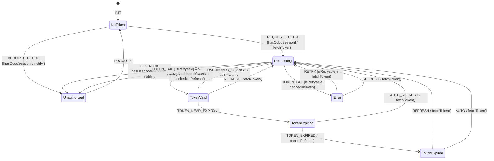

# Guest Token Acquisition FSM

**Source**: `infra/superset/superset_config.py`, `addons/ipai/ipai_superset_connector/static/src/js/superset_embed.js`

## Overview

JWT guest token acquisition flow for embedded Superset dashboards, issued by Odoo backend and validated by Superset.

## States

| State | Description |
|-------|-------------|
| `NoToken` | Initial state, no token |
| `Requesting` | Token request in progress |
| `TokenValid` | Valid token, can embed |
| `TokenExpiring` | Token near expiry threshold |
| `TokenExpired` | Token TTL exceeded |
| `Error` | Token request failed |
| `Unauthorized` | User lacks permission for dashboard |

## Events

| Event | Source | Description |
|-------|--------|-------------|
| `REQUEST_TOKEN` | Client | Initiate token fetch |
| `TOKEN_OK` | System | Token received |
| `TOKEN_FAIL` | System | Token request error |
| `TOKEN_NEAR_EXPIRY` | System | Timer: token expiring soon |
| `TOKEN_EXPIRED` | System | Token TTL exceeded |
| `REFRESH` | Client | Manual refresh |
| `DASHBOARD_CHANGE` | Client | Different dashboard requested |
| `AUTH_FAIL` | System | 401/403 from Superset |

## Guards

| Guard | Condition |
|-------|-----------|
| `hasOdooSession` | User authenticated in Odoo |
| `hasDashboardAccess` | User allowed to view dashboard |
| `tokenNotExpired` | `exp > Date.now()` |
| `nearExpiry` | `exp - Date.now() < threshold` |
| `isRetryable` | Error is transient (network, 500) |

## Side Effects

| Action | Endpoint | Description |
|--------|----------|-------------|
| `fetchToken` | `GET /ipai/superset/guest_token/{id}` | Request guest token |
| `validateClaims` | N/A | Check JWT audience, exp |
| `scheduleRefresh` | N/A | Set timer for proactive refresh |
| `cancelRefresh` | N/A | Clear refresh timer |
| `notify` | N/A | Display error to user |

## Transition Table

| From | Event | Guard | To | Action |
|------|-------|-------|----|--------|
| NoToken | REQUEST_TOKEN | hasOdooSession | Requesting | fetchToken() |
| NoToken | REQUEST_TOKEN | !hasOdooSession | Unauthorized | notify(login) |
| Requesting | TOKEN_OK | hasDashboardAccess | TokenValid | scheduleRefresh() |
| Requesting | TOKEN_OK | !hasDashboardAccess | Unauthorized | notify(noaccess) |
| Requesting | TOKEN_FAIL | isRetryable | Error | scheduleRetry() |
| Requesting | TOKEN_FAIL | !isRetryable | Unauthorized | notify() |
| TokenValid | TOKEN_NEAR_EXPIRY | - | TokenExpiring | - |
| TokenValid | DASHBOARD_CHANGE | - | Requesting | cancelRefresh, fetchToken() |
| TokenValid | REFRESH | - | Requesting | cancelRefresh, fetchToken() |
| TokenExpiring | AUTO_REFRESH | - | Requesting | fetchToken() |
| TokenExpiring | TOKEN_EXPIRED | - | TokenExpired | cancelRefresh() |
| TokenExpired | REFRESH | - | Requesting | fetchToken() |
| TokenExpired | AUTO | - | Requesting | fetchToken() |
| Error | RETRY | isRetryable | Requesting | clearError, fetchToken() |
| Error | REFRESH | - | Requesting | clearError, fetchToken() |

## Mermaid Diagram



## Token Flow Sequence

```
┌─────────┐     ┌──────────┐     ┌──────────────┐     ┌──────────┐
│  Client │     │   Odoo   │     │ Guest Token  │     │ Superset │
│  (OWL)  │     │ Backend  │     │   Service    │     │          │
└────┬────┘     └────┬─────┘     └──────┬───────┘     └────┬─────┘
     │               │                  │                  │
     │ GET /ipai/superset/guest_token/X │                  │
     │──────────────>│                  │                  │
     │               │                  │                  │
     │               │ User context     │                  │
     │               │ + permissions    │                  │
     │               │─────────────────>│                  │
     │               │                  │                  │
     │               │                  │ Sign JWT         │
     │               │                  │ (audience,       │
     │               │                  │  user, rls,      │
     │               │                  │  dashboard)      │
     │               │                  │                  │
     │               │  guest_token     │                  │
     │               │<─────────────────│                  │
     │               │                  │                  │
     │  { token,     │                  │                  │
     │    superset_url }                │                  │
     │<──────────────│                  │                  │
     │               │                  │                  │
     │ GET /superset/dashboard/X/?guest_token=...         │
     │───────────────────────────────────────────────────>│
     │               │                  │                  │
     │               │                  │    Validate JWT  │
     │               │                  │<─────────────────│
     │               │                  │    (signature,   │
     │               │                  │     exp, aud)    │
     │               │                  │─────────────────>│
     │               │                  │                  │
     │                        Dashboard HTML               │
     │<───────────────────────────────────────────────────│
```

## Identified Gaps

1. **No proactive refresh**: Token refresh only on explicit trigger, not automatic
2. **TTL not tracked client-side**: Client doesn't know when token expires
3. **Missing JWT validation**: Client doesn't verify token claims
4. **No refresh token**: Single-use guest token, requires full re-auth
5. **RLS claims static**: Row-level security claims set at token time, not dynamic
6. **Session coupling**: Odoo session expiry doesn't invalidate cached guest token
7. **No token revocation**: Can't invalidate token before expiry
8. **Audience mismatch possible**: `GUEST_TOKEN_JWT_AUDIENCE` must match Superset config
9. **Secret rotation unsafe**: Changing `GUEST_TOKEN_JWT_SECRET` invalidates all tokens
10. **Missing rate limiting**: No throttle on token requests
