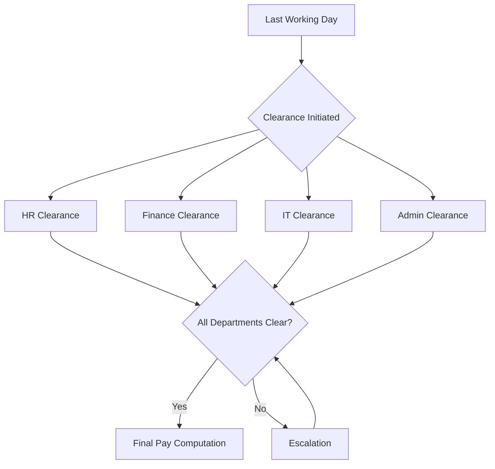

# Clearance workflow

The clearance workflow runs a 4-department parallel process to verify that a separating employee has returned all assets, settled all obligations, and had all system access revoked. The target SLA is 5 business days from the employee's last working day.

## Process overview



All four departments work in parallel. The clearance is complete only when all departments have signed off.

## SLA timeline

| Day | Action | Status |
|-----|--------|--------|
| Day 0 | Last working day; clearance auto-initiated | `in_progress` |
| Day 1-2 | Departments process checklists | `in_progress` |
| Day 3 | First escalation alert to department heads | :material-alert: Warning |
| Day 4 | Second escalation alert to HR Director | :material-alert-circle: Escalated |
| Day 5 | Final deadline; unresolved items block final pay | :material-close-circle: Overdue |

!!! warning "SLA breach impact"
    If clearance exceeds 5 business days, the final pay SLA (7 business days internal) is at risk. Escalation alerts fire automatically at Day 3, Day 4, and Day 5.

## Department checklists

### HR clearance (8 items)

| # | Item | Verification |
|---|------|-------------|
| 1 | Exit interview completed | Interview form signed |
| 2 | Resignation letter on file | Document attached to employee record |
| 3 | Non-disclosure agreement acknowledged | NDA confirmation signed |
| 4 | Benefits enrollment terminated | SSS, PhilHealth, Pag-IBIG notified |
| 5 | Leave balance reconciled | Final leave balance confirmed |
| 6 | Training bond settled (if applicable) | Bond computation cleared by Finance |
| 7 | Employee handbook returned | Physical copy returned or waived |
| 8 | ID and access badges returned | Physical items collected |

### Finance clearance (7 items)

| # | Item | Verification |
|---|------|-------------|
| 1 | Cash advances settled | Zero outstanding balance in `hr.salary.advance` |
| 2 | Expense reports reconciled | All submitted claims processed |
| 3 | Company credit card returned | Card collected and deactivated |
| 4 | Petty cash accounted | Petty cash custodianship transferred |
| 5 | Loan balances settled | Outstanding loans deducted or paid |
| 6 | Tax documents prepared | BIR Form 2316 drafted |
| 7 | Final pay pre-computation reviewed | Preliminary final pay validated |

### IT clearance (11 items)

| # | Item | Verification |
|---|------|-------------|
| 1 | Email account disabled | Account deactivated in directory |
| 2 | Odoo access revoked | User set to inactive |
| 3 | VPN credentials revoked | VPN profile deleted |
| 4 | Laptop returned | Asset tag verified, condition noted |
| 5 | Mobile device returned (if issued) | Device collected, MDM wiped |
| 6 | Software licenses reclaimed | Licenses freed in vendor portals |
| 7 | Cloud storage transferred | Files transferred to manager or archived |
| 8 | MFA tokens revoked | All 2FA enrollments removed |
| 9 | SSH keys / API tokens revoked | Keys removed from all systems |
| 10 | Shared password rotation | Shared credentials rotated |
| 11 | Slack account deactivated | Workspace access removed |

### Admin clearance (9 items)

| # | Item | Verification |
|---|------|-------------|
| 1 | Office keys returned | Key register updated |
| 2 | Parking pass returned | Pass deactivated |
| 3 | Building access card deactivated | Access control system updated |
| 4 | Company vehicle returned (if applicable) | Vehicle condition documented |
| 5 | Uniform returned | Uniform collected or waiver signed |
| 6 | Locker cleared | Locker inspected and reassigned |
| 7 | Company materials returned | Books, manuals, supplies returned |
| 8 | Forwarding address confirmed | For final documents delivery |
| 9 | Desk / workspace cleared | Workspace ready for reassignment |

## System access revocation

Access revocation follows a specific sequence to prevent data loss while ensuring security.

| Step | System | Action | Timing |
|------|--------|--------|--------|
| 1 | Odoo ERP | Set user to `inactive` | Last working day, end of business |
| 2 | Email | Disable account, set auto-reply | Last working day, end of business |
| 3 | Slack | Deactivate workspace member | Last working day, end of business |
| 4 | VPN | Revoke VPN profile | Last working day, end of business |
| 5 | Cloud storage | Transfer ownership to manager | Within 24 hours |
| 6 | SSH / API keys | Remove from all servers | Within 24 hours |
| 7 | Third-party SaaS | Revoke access in each platform | Within 48 hours |
| 8 | Shared credentials | Rotate all shared passwords | Within 48 hours |

!!! danger "Critical security requirement"
    Steps 1-4 must execute on the employee's last working day. Do not wait for clearance completion to revoke system access.

## SLA monitoring

The `ipai_hr_clearance` module provides automated SLA monitoring.

| Alert | Trigger | Recipients | Channel |
|-------|---------|------------|---------|
| Warning | Day 3, any item incomplete | Department head | Odoo notification + Slack |
| Escalation | Day 4, any item incomplete | HR Director + department head | Odoo notification + Slack + email |
| Breach | Day 5, any item incomplete | HR Director + Finance Director | Odoo notification + Slack + email |

### Monitoring fields

```python
class HrClearance(models.Model):
    _name = 'hr.clearance'

    employee_id = fields.Many2one('hr.employee')
    last_working_day = fields.Date()
    state = fields.Selection([
        ('draft', 'Draft'),
        ('in_progress', 'In Progress'),
        ('done', 'Completed'),
        ('overdue', 'Overdue'),
    ])
    hr_cleared = fields.Boolean()
    finance_cleared = fields.Boolean()
    it_cleared = fields.Boolean()
    admin_cleared = fields.Boolean()
    sla_days_elapsed = fields.Integer(compute='_compute_sla')
```

## Integration with final pay

When all four departments mark their clearance as complete, the system automatically:

1. Set clearance state to `done`
2. Create a draft `hr.final.pay` record
3. Pre-fill data from clearance into the final pay computation:

| Clearance data | Final pay field | Source |
|----------------|-----------------|--------|
| Outstanding cash advances | Deduction: advances | Finance clearance |
| Unreturned asset values | Deduction: assets | IT + Admin clearance |
| Leave balance | Addition: leave conversion | HR clearance |
| Training bond balance | Deduction: training bond | HR clearance |
| Expense claims pending | Addition: reimbursements | Finance clearance |

This pre-fill eliminates duplicate data entry and ensures the final pay computation reflects verified clearance data.
