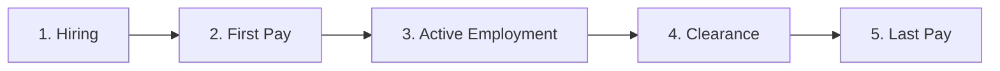

# Hire-to-retire overview

The hire-to-retire (H2R) process covers the complete employee lifecycle at InsightPulse AI, from job offer acceptance through final separation. All workflows enforce Philippine labor compliance and integrate with Odoo CE 19 HR modules.

## Lifecycle phases

| Phase | Trigger | Key actions | Completion criteria |
|-------|---------|-------------|---------------------|
| **Hiring** | Signed job offer | Create employee record, set up contracts, enroll in benefits | Employee record active in Odoo |
| **First Pay** | 7 days worked | Validate bank details, compute pro-rated salary, run first payroll | First payslip generated |
| **Active Employment** | First pay complete | Leave management, performance reviews, payroll cycles | Ongoing |
| **Clearance** | Resignation / termination | 4-department parallel clearance, asset return, access revocation | All departments sign off |
| **Last Pay** | Clearance complete | Final pay computation, tax annualization, release of documents | Final payslip + COE released |

## Stakeholders

| Role | Responsibilities | Odoo group |
|------|-----------------|------------|
| HR Director | Policy approval, SLA oversight, DOLE compliance | `hr.group_hr_manager` |
| Finance Director | Final pay approval, tax compliance sign-off | `account.group_account_manager` |
| HR Operations | Day-to-day processing, document preparation, clearance coordination | `hr.group_hr_user` |
| IT Admin | System access provisioning and revocation | `base.group_system` |
| Admin Manager | Asset tracking, facility access, equipment return | `hr.group_hr_user` |

## DOLE statutory requirements

!!! warning "Non-negotiable compliance deadlines"
    These deadlines are mandated by Philippine labor law. Failure to comply exposes the company to DOLE penalties.

| Requirement | Deadline | Legal basis |
|-------------|----------|-------------|
| Final pay release | 30 days from separation | Labor Advisory 06-20 |
| Certificate of employment | 3 days from request | Labor Code Article 285 |
| Pay frequency | Twice per month (max 16-day interval) | Labor Code Article 103 |
| 13th month pay | On or before December 24 | PD 851 |
| Last pay slip | With final pay release | DOLE Department Order 174-17 |

## Internal SLAs

These SLAs are stricter than statutory requirements to provide compliance buffer.

| Process | Internal SLA | Statutory deadline | Buffer |
|---------|-------------|-------------------|--------|
| Final pay release | 7 business days | 30 calendar days | 23 days |
| First pay processing | 7 days from start | Next regular payroll | Varies |
| Clearance completion | 5 business days | No statutory deadline | N/A |
| COE issuance | 1 business day | 3 calendar days | 2 days |
| Exit interview | Last working day | No statutory deadline | N/A |

## KPIs

| Metric | Target | Measurement |
|--------|--------|-------------|
| Final pay SLA compliance | >= 95% | % of final pays released within 7 business days |
| Clearance completion rate | >= 98% | % of clearances completed within 5 business days |
| First pay accuracy | >= 99% | % of first payslips with zero corrections |
| COE turnaround | >= 99% | % of COEs issued within 1 business day |
| Exit interview completion | >= 90% | % of separating employees with completed exit interviews |

## Odoo module stack

| Module | Type | Purpose |
|--------|------|---------|
| `hr` | Core | Employee master data, department structure |
| `hr_contract` | Core | Employment contracts, compensation |
| `hr_holidays` | Core | Leave management, accruals, conversions |
| `hr_payroll` | Core | Payroll computation, payslips |
| `project` | Core | Task tracking for clearance workflow |
| `account` | Core | Journal entries for payroll, final pay |
| `hr_employee_document` | OCA | Employee document management |
| `ipai_hr_clearance` | Custom | 4-department clearance workflow |
| `ipai_hr_final_pay` | Custom | Final pay computation engine |
| `ipai_hr_coe` | Custom | COE generation and tracking |

## Approval workflow

The separation process follows a 12-step approval workflow from resignation to full termination.

| Step | Action | Responsible | System |
|------|--------|-------------|--------|
| 1 | Employee submits resignation | Employee | Odoo HR self-service |
| 2 | Manager acknowledges resignation | Direct manager | Odoo approval |
| 3 | HR records last working day | HR Operations | `hr.departure.wizard` |
| 4 | HR triggers clearance workflow | HR Operations | `ipai_hr_clearance` |
| 5 | IT revokes system access | IT Admin | Clearance checklist |
| 6 | Admin collects assets | Admin Manager | Clearance checklist |
| 7 | Finance verifies outstanding balances | Finance | Clearance checklist |
| 8 | HR completes exit interview | HR Operations | Clearance checklist |
| 9 | All departments sign off clearance | Department heads | Parallel approval |
| 10 | Finance computes final pay | Finance | `ipai_hr_final_pay` |
| 11 | Finance Director approves final pay | Finance Director | Odoo approval |
| 12 | HR archives employee, releases COE | HR Operations | `ipai_hr_coe` |

## Common issues

| Issue | Root cause | Solution |
|-------|-----------|----------|
| Final pay delayed beyond SLA | Clearance not completed on time | Enable Day 3 escalation alerts in clearance workflow |
| Incorrect pro-rated salary | Wrong working days count | Use `hr.payroll` calendar-based computation, not manual |
| Missing government contributions | Employee not enrolled in benefits on hire | Add benefits enrollment to hiring checklist |
| COE not generated | Clearance still in progress | COE generation does not require clearance; decouple the processes |
| First pay incorrect | Contract effective date mismatch | Validate contract start date matches actual first day |
| Leave balance wrong at separation | Accrual not updated before computation | Force leave accrual recomputation before final pay |
| Tax under-withheld on final pay | Annualization not applied | Use BIR RR 11-2018 annualization formula in `ipai_hr_final_pay` |
