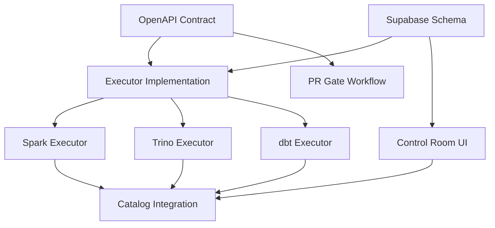

# Plan — Lakehouse Control Room

## Phase 0 — Repo + CI Baseline
- [x] Add Spec Kit PR gate (required check)
- [x] Add linting for YAML/MD where appropriate
- [x] Add secret scanning rules (allowlist where needed)

## Phase 1 — Ops Schema + RLS (Supabase)
- [x] Create `ops.runs`, `ops.run_events`, `ops.artifacts`, `ops.executors`
- [x] Create caps tables: `ops.caps`, `ops.cap_usage`
- [x] Create routing tables: `ops.routing_matrix`, `ops.alert_rules`, `ops.notifications`
- [x] Create scoring tables: `ops.signal_weights`, `ops.signals`, `ops.run_scores`
- [ ] Implement RLS: org/project/environment scopes
- [x] Add RPCs: `claim_run`, `heartbeat_run`, `start_run`, `complete_run`, `fail_run`, `cancel_run`
- [x] Add RPCs: `compute_run_score`, `cap_allow`, `requeue_stale_runs`

## Phase 2 — Executor (Stateless Worker)
- [ ] Implement Edge Function executor skeleton
- [ ] Implement executor loop:
  - claim → run phase handler → emit events → register artifacts → complete phase
- [ ] Support two execution modes:
  - Edge Function (lightweight)
  - Docker worker (heavier compute on DO)
- [ ] Phase handler registry (ingest/validate/transform/publish/query)
- [ ] Idempotency + retries
- [ ] Artifact upload + registration
- [ ] Lease renewal / timeout handling
- [ ] Structured logging + event emission

## Phase 3 — Pipeline Templates (Medallion)
- [ ] Define pipeline spec format (YAML/JSON):
  - sources, destinations, validations, transforms, publish steps
- [ ] Implement reference pipelines:
  - `odoo_ingest_bronze`
  - `bronze_to_silver`
  - `silver_to_gold`
- [ ] Add deterministic output manifests (hashing)
- [ ] Data quality checks (row counts, schema drift, null thresholds)

## Phase 4 — SQL + BI Layer
- [ ] MVP: store SQL text + results manifest (CSV/Parquet reference)
- [ ] Integrate Superset datasets/views (gold)
- [ ] Add "query run" phase type
- [ ] Result preview artifact (sample rows)
- [ ] Permissions mapping (RLS ↔ BI roles)

## Phase 5 — Odoo-Live Cutover
- [ ] Connect Odoo prod DB (or CDC)
- [ ] Table grouping plan (finance/ops/masterdata)
- [ ] Run staged ingestion per table group
- [ ] Enforce SLOs + alerts + rollback plan
- [ ] Backfill + replay strategy
- [ ] Cutover checklist (prod)

## Deliverables
- [x] OpenAPI contract (`contracts/lakehouse-executor.openapi.yaml`)
- [x] Ops schema migration (`supabase/migrations/20260124_1000_ops_lakehouse_control_plane.sql`)
- [x] Spec bundle complete
- [x] CI gates enforced (PR gate workflow)
- [ ] Executor contract implemented end-to-end
- [ ] Odoo ingestion pipelines live
- [ ] BI datasets publishable with minimal manual operations

## Dependencies

## Success Checkpoints

### Phase 1 Complete When:
- [x] All CI gates pass
- [x] Contract validates
- [x] Schema applies cleanly
- [x] Spec bundle complete

### Phase 2 Complete When:
- [ ] Executors can claim/run/report
- [ ] Artifacts stored with checksums
- [ ] Events stream in real-time
- [ ] Caps enforce correctly

### Phase 3 Complete When:
- [ ] Pipeline specs validate in CI
- [ ] Medallion pipelines run end-to-end
- [ ] Data quality gates enforce

### Phase 4 Complete When:
- [ ] SQL results stored as artifacts
- [ ] Superset datasets refresh from gold
- [ ] Query history searchable

### Phase 5 Complete When:
- [ ] Odoo tables ingested to bronze
- [ ] SLOs met for freshness
- [ ] Alerts fire on failures
