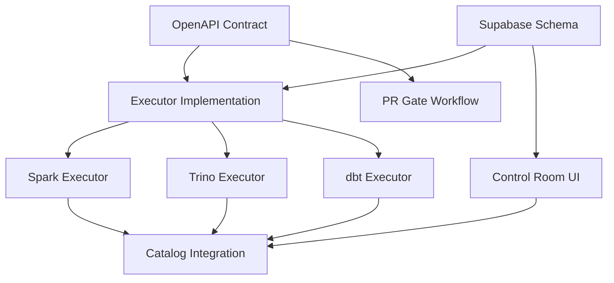

# Lakehouse Control Room - Implementation Plan

## Overview

This plan outlines the implementation phases for the Lakehouse Control Room system, an open-source Databricks alternative built on Supabase + containerized executors.

## Phase 1: Foundation (Current Sprint)

### 1.1 Contract & Schema

- [x] Create OpenAPI contract (`contracts/lakehouse-executor.openapi.yaml`)
- [x] Create Supabase migration for ops schema
- [x] Create spec bundle with governance rules
- [ ] Create PR gate workflow for validation
- [ ] Create validation scripts

### 1.2 Backlog & Routing

- [ ] Create canonical backlog YAML
- [ ] Create routing matrix seed data
- [ ] Create caps report generator
- [ ] Create export validation scripts

### 1.3 CI Integration

- [ ] OpenAPI contract validator
- [ ] Supabase migrations lint
- [ ] Spec-kit bundle check
- [ ] PR comment summary automation

## Phase 2: Executor Implementation

### 2.1 Core Executor

- [ ] Claim/heartbeat/finalize RPC implementation
- [ ] Basic task execution loop
- [ ] Event streaming (SSE)
- [ ] Artifact upload/checksum

### 2.2 Spark Executor

- [ ] Spark submit wrapper
- [ ] Driver/executor log capture
- [ ] Resource limit enforcement
- [ ] Delta table operations

### 2.3 Trino Executor

- [ ] Query submission
- [ ] Result pagination
- [ ] Query history logging
- [ ] Cost estimation

### 2.4 dbt Executor

- [ ] dbt run/test commands
- [ ] Manifest artifact capture
- [ ] Lineage extraction
- [ ] Incremental model support

## Phase 3: Control Room UI

### 3.1 Core Pages

- [ ] Runs list/detail view
- [ ] Events timeline
- [ ] Artifact browser
- [ ] Executor registry

### 3.2 Job Management

- [ ] Job templates CRUD
- [ ] Schedule configuration
- [ ] Promotion gates UI
- [ ] Run history

### 3.3 Governance

- [ ] Routing matrix editor
- [ ] Caps configuration
- [ ] Alert rules management
- [ ] Notification preferences

## Phase 4: Advanced Features

### 4.1 Catalog Integration

- [ ] OpenMetadata connector
- [ ] Dataset registry
- [ ] Lineage visualization
- [ ] Access policy editor

### 4.2 ML Integration

- [ ] MLflow experiment tracking
- [ ] Model registry UI
- [ ] Serving endpoint management

### 4.3 Analytics

- [ ] Superset embedding
- [ ] Dashboard templates
- [ ] NL→SQL interface

## Dependencies

## Resource Requirements

| Resource | Type | Purpose |
|----------|------|---------|
| Supabase Project | Infrastructure | Control plane SSOT |
| Object Storage | Infrastructure | Artifacts + tables |
| K8s/Docker | Compute | Executor runtime |
| GitHub Actions | CI/CD | Validation + deployment |

## Timeline Estimates

| Phase | Effort | Dependencies |
|-------|--------|--------------|
| Phase 1 | 1-2 sprints | None |
| Phase 2 | 3-4 sprints | Phase 1 |
| Phase 3 | 2-3 sprints | Phase 2 |
| Phase 4 | 4-6 sprints | Phase 3 |

## Success Checkpoints

### Phase 1 Complete When:
- All CI gates pass
- Contract validates
- Schema applies cleanly
- Spec bundle complete

### Phase 2 Complete When:
- Executors can claim/run/report
- Artifacts stored with checksums
- Events stream in real-time
- Caps enforce correctly

### Phase 3 Complete When:
- UI displays runs/events
- Jobs can be scheduled
- Routing works end-to-end
- Alerts fire correctly

### Phase 4 Complete When:
- Catalog shows all tables
- Lineage traces visible
- ML experiments track
- Dashboards embed
