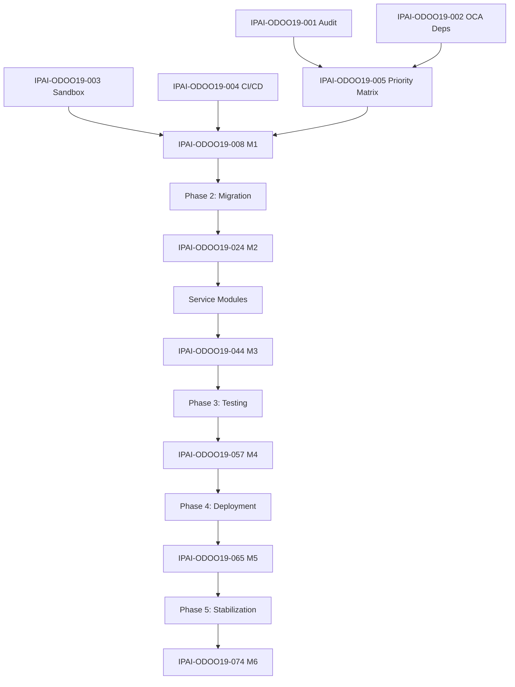

# Odoo 19 Migration - Task Breakdown
---
**Epic**: IPAI-ODOO19
**Sprint Length**: 1 week
**Story Points**: 1 SP = ~4 hours
---

## Task Summary

| Phase | Stories | Total SP | Est. Hours |
|-------|---------|----------|------------|
| Phase 1: Preparation | 8 | 24 | 96 |
| Phase 2: Migration | 20 | 60 | 240 |
| Phase 3: Testing | 8 | 20 | 80 |
| Phase 4: Deployment | 6 | 12 | 48 |
| Phase 5: Stabilization | 5 | 10 | 40 |
| **Total** | **47** | **126** | **504** |

---

## Phase 1: Preparation Tasks

### IPAI-ODOO19-001: Audit ipai_* Modules for Deprecated Patterns
```yaml
Type: Task
Priority: P0 - Critical
Story Points: 4
Assignee: TBD
Sprint: Week 1

Description: |
  Audit all 80+ ipai_* modules for Odoo 18→19 breaking changes.

Acceptance Criteria:
  - [ ] All modules checked for <tree> tags (must be <list>)
  - [ ] All modules checked for deprecated Python APIs
  - [ ] All modules checked for OWL 1.x patterns
  - [ ] Audit report generated with findings

Subtasks:
  - [ ] Create audit script to scan for patterns
  - [ ] Run script against all modules
  - [ ] Manually verify complex cases
  - [ ] Document findings in AUDIT_REPORT.md
```

### IPAI-ODOO19-002: Document OCA Dependencies
```yaml
Type: Task
Priority: P0 - Critical
Story Points: 2
Assignee: TBD
Sprint: Week 1

Description: |
  Map all OCA module dependencies and check Odoo 19 availability.

Acceptance Criteria:
  - [ ] All OCA dependencies listed
  - [ ] Odoo 19 version availability checked
  - [ ] Alternatives identified for unavailable modules
  - [ ] Decision matrix created

Deliverable: OCA_DEPENDENCY_MATRIX.md
```

### IPAI-ODOO19-003: Provision Odoo 19 Development Sandbox
```yaml
Type: Task
Priority: P0 - Critical
Story Points: 4
Assignee: DevOps
Sprint: Week 1

Description: |
  Set up isolated Odoo 19 CE development environment.

Acceptance Criteria:
  - [ ] Docker Compose file for Odoo 19 created
  - [ ] Sandbox accessible at dev-19.erp.insightpulseai.net
  - [ ] PostgreSQL 16 configured
  - [ ] Volume mounts for addon development
  - [ ] Test data seeded

Technical Notes:
  - Use DigitalOcean Droplet (4GB RAM, 2 vCPU)
  - Separate from production database
  - Enable developer mode by default
```

### IPAI-ODOO19-004: Configure CI/CD for Dual-Version Testing
```yaml
Type: Task
Priority: P1 - High
Story Points: 3
Assignee: DevOps
Sprint: Week 1

Description: |
  Update GitHub Actions to test modules against both Odoo 18 and 19.

Acceptance Criteria:
  - [ ] Matrix build: Odoo 18.0 + 19.0
  - [ ] Tests run on both versions
  - [ ] Clear pass/fail indication per version
  - [ ] Migration branch protection rules

Example Workflow:
  jobs:
    test:
      strategy:
        matrix:
          odoo-version: ['18.0', '19.0']
      steps:
        - uses: actions/checkout@v4
        - name: Test on Odoo ${{ matrix.odoo-version }}
          run: |
            docker run -d --name odoo odoo:${{ matrix.odoo-version }}
            docker exec odoo odoo-bin --test-enable -i ipai_*
```

### IPAI-ODOO19-005: Create Module Migration Priority Matrix
```yaml
Type: Task
Priority: P1 - High
Story Points: 2
Assignee: Lead
Sprint: Week 2

Description: |
  Prioritize modules for migration based on business criticality.

Acceptance Criteria:
  - [ ] All modules categorized (Core, Service, Integration, Utility)
  - [ ] Dependencies mapped
  - [ ] Migration order defined
  - [ ] Resource allocation planned

Output:
| Priority | Module | Dependencies | Est. Hours |
|----------|--------|--------------|------------|
| P0 | ipai_bir_* | account | 24 |
| P0 | ipai_hr_payroll_ph | hr_payroll | 16 |
| P1 | ipai_approvals | mail | 8 |
| ... | ... | ... | ... |
```

### IPAI-ODOO19-006: Set Up Test Database with Representative Data
```yaml
Type: Task
Priority: P1 - High
Story Points: 2
Assignee: QA
Sprint: Week 2

Description: |
  Create test database with anonymized production-like data.

Acceptance Criteria:
  - [ ] Account moves (1000+ records)
  - [ ] Payslips (500+ records)
  - [ ] Employees (50+ records)
  - [ ] Products (100+ records)
  - [ ] PII anonymized

Technical Notes:
  - Use pg_dump with --exclude-table for sensitive tables
  - Run anonymization scripts
  - Verify data relationships intact
```

### IPAI-ODOO19-007: Document Breaking Changes
```yaml
Type: Task
Priority: P1 - High
Story Points: 3
Assignee: Dev
Sprint: Week 2

Description: |
  Comprehensive documentation of all Odoo 18→19 breaking changes.

Acceptance Criteria:
  - [ ] All breaking changes from Odoo release notes captured
  - [ ] Impact on ipai_* modules assessed
  - [ ] Migration actions documented
  - [ ] Examples provided for each change type

Deliverable: docs/BREAKING_CHANGES.md
```

### IPAI-ODOO19-008: Milestone M1 - Sandbox Ready
```yaml
Type: Milestone
Priority: P0 - Critical
Story Points: 1
Assignee: Lead
Sprint: Week 2

Description: |
  Go/No-go decision point for proceeding with migration.

Gate Criteria:
  - [ ] Sandbox functional and accessible
  - [ ] CI/CD pipeline working
  - [ ] Audit complete with no blockers
  - [ ] OCA dependencies available or alternatives identified
  - [ ] Team aligned on plan

Decision: ☐ GO / ☐ NO-GO
```

---

## Phase 2: Migration Tasks

### IPAI-ODOO19-010: Migrate ipai_bir_1601c
```yaml
Type: Story
Priority: P0 - Critical
Story Points: 4
Assignee: TBD
Sprint: Week 3

Description: |
  Migrate BIR 1601-C (Monthly Withholding Tax) module to Odoo 19.

Acceptance Criteria:
  - [ ] Module installs without errors
  - [ ] Report generates correctly
  - [ ] BIR format compliance verified
  - [ ] All tests pass
  - [ ] Code reviewed and approved

Subtasks:
  - [ ] Update __manifest__.py version
  - [ ] Replace <tree> with <list> tags
  - [ ] Update deprecated API calls
  - [ ] Run unit tests
  - [ ] Manual validation with test data
```

### IPAI-ODOO19-011: Migrate ipai_bir_2316
```yaml
Type: Story
Priority: P0 - Critical
Story Points: 4
Assignee: TBD
Sprint: Week 3

Description: |
  Migrate BIR 2316 (Certificate of Compensation Payment) to Odoo 19.

Acceptance Criteria:
  - [ ] Module installs without errors
  - [ ] Certificate generates correctly
  - [ ] All employee fields populated
  - [ ] PDF output matches BIR format

Subtasks:
  - [ ] Update manifest and dependencies
  - [ ] Migrate QWeb report templates
  - [ ] Test with multiple employee types
  - [ ] Verify signature fields
```

### IPAI-ODOO19-012: Migrate ipai_bir_alphalist
```yaml
Type: Story
Priority: P0 - Critical
Story Points: 4
Assignee: TBD
Sprint: Week 3

Description: |
  Migrate BIR Alphalist (Annual Information Return) to Odoo 19.

Acceptance Criteria:
  - [ ] DAT file generation works
  - [ ] All employee records included
  - [ ] Totals match individual 2316s
  - [ ] File passes BIR validation
```

### IPAI-ODOO19-013: Migrate ipai_bir_vat
```yaml
Type: Story
Priority: P1 - High
Story Points: 2
Assignee: TBD
Sprint: Week 3

Description: |
  Migrate VAT-related BIR forms (2550M, 2550Q) to Odoo 19.

Acceptance Criteria:
  - [ ] Monthly VAT declaration generates
  - [ ] Quarterly VAT return generates
  - [ ] Sales/Purchase VAT correctly computed
```

### IPAI-ODOO19-014: Update OCA Account Modules
```yaml
Type: Story
Priority: P0 - Critical
Story Points: 4
Assignee: TBD
Sprint: Week 3

Description: |
  Update OCA accounting modules to Odoo 19 versions.

Modules:
  - account_financial_report
  - account_reconcile_oca
  - account_statement_import
  - account_asset_management

Acceptance Criteria:
  - [ ] All modules from OCA 19.0 branch
  - [ ] No conflicts with ipai_* modules
  - [ ] Existing data migrates correctly
```

### IPAI-ODOO19-020: Migrate ipai_hr_payroll_ph
```yaml
Type: Story
Priority: P0 - Critical
Story Points: 8
Assignee: TBD
Sprint: Week 4

Description: |
  Migrate Philippine Payroll module - CRITICAL PATH.

Acceptance Criteria:
  - [ ] SSS computation correct (2025 tables)
  - [ ] PhilHealth computation correct
  - [ ] Pag-IBIG computation correct
  - [ ] Withholding tax correct (TRAIN Law)
  - [ ] 13th month pay computed
  - [ ] All payslip fields populated
  - [ ] Integration with BIR modules works

Subtasks:
  - [ ] Migrate salary rules
  - [ ] Update contribution tables
  - [ ] Test with 50+ employee payroll run
  - [ ] Verify decimal precision
  - [ ] Performance benchmark (<500ms/payslip)

Risk: HIGH - Core business function
Rollback: Keep Odoo 18 payroll as fallback until verified
```

### IPAI-ODOO19-021: Migrate ipai_hr_attendance
```yaml
Type: Story
Priority: P1 - High
Story Points: 2
Assignee: TBD
Sprint: Week 4

Description: |
  Migrate attendance tracking module.

Acceptance Criteria:
  - [ ] Check-in/check-out works
  - [ ] Integration with payroll (overtime, tardiness)
  - [ ] Reports generate correctly
```

### IPAI-ODOO19-022: Migrate ipai_hr_leave
```yaml
Type: Story
Priority: P1 - High
Story Points: 2
Assignee: TBD
Sprint: Week 4

Description: |
  Migrate leave management module.

Acceptance Criteria:
  - [ ] Leave requests submit correctly
  - [ ] Approval workflow works
  - [ ] Leave balance tracking accurate
  - [ ] Integration with payroll deductions
```

### IPAI-ODOO19-023: Update OCA HR Modules
```yaml
Type: Story
Priority: P1 - High
Story Points: 4
Assignee: TBD
Sprint: Week 4

Description: |
  Update OCA HR modules to Odoo 19 versions.

Modules:
  - hr_payroll
  - hr_expense
  - hr_holidays (if used)

Acceptance Criteria:
  - [ ] All modules compatible
  - [ ] No regression in existing functionality
```

### IPAI-ODOO19-024: Milestone M2 - Core Modules Migrated
```yaml
Type: Milestone
Priority: P0 - Critical
Story Points: 1
Assignee: Lead
Sprint: Week 4

Description: |
  Core accounting and payroll modules verified on Odoo 19.

Gate Criteria:
  - [ ] All BIR modules pass tests
  - [ ] Payroll computes correctly
  - [ ] No P0 bugs open
  - [ ] Finance team preview sign-off

Decision: ☐ Continue / ☐ Pause for fixes
```

### IPAI-ODOO19-030: Migrate ipai_approvals
```yaml
Type: Story
Priority: P1 - High
Story Points: 4
Assignee: TBD
Sprint: Week 5

Description: |
  Migrate multi-level approval workflow module.

Acceptance Criteria:
  - [ ] Approval request creation works
  - [ ] Multi-level routing works
  - [ ] Amount thresholds respected
  - [ ] Email notifications sent
  - [ ] Audit trail preserved
```

### IPAI-ODOO19-031: Migrate ipai_helpdesk
```yaml
Type: Story
Priority: P1 - High
Story Points: 4
Assignee: TBD
Sprint: Week 5

Description: |
  Migrate helpdesk ticketing module.

Acceptance Criteria:
  - [ ] Ticket creation works (all channels)
  - [ ] SLA tracking functional
  - [ ] Auto-assignment works
  - [ ] Customer portal accessible
  - [ ] Reports accurate
```

### IPAI-ODOO19-032: Migrate ipai_planning
```yaml
Type: Story
Priority: P1 - High
Story Points: 4
Assignee: TBD
Sprint: Week 5

Description: |
  Migrate resource planning/shift scheduling module.

Acceptance Criteria:
  - [ ] Shift creation works
  - [ ] Conflict detection works
  - [ ] Calendar view renders correctly
  - [ ] Gantt view renders correctly
  - [ ] Employee self-service works
```

### IPAI-ODOO19-033: Migrate ipai_timesheet
```yaml
Type: Story
Priority: P2 - Medium
Story Points: 2
Assignee: TBD
Sprint: Week 5

Description: |
  Migrate timesheet module.

Acceptance Criteria:
  - [ ] Time entry works
  - [ ] Grid view functional
  - [ ] Timer widget works (OWL 2.x)
  - [ ] Integration with invoicing
```

### IPAI-ODOO19-040: Migrate ipai_connector_vercel
```yaml
Type: Story
Priority: P2 - Medium
Story Points: 2
Assignee: TBD
Sprint: Week 6

Description: |
  Migrate Vercel Observability integration.

Acceptance Criteria:
  - [ ] Metrics sync works
  - [ ] Alert creation works
  - [ ] Superset integration functional
```

### IPAI-ODOO19-041: Migrate ipai_connector_supabase
```yaml
Type: Story
Priority: P2 - Medium
Story Points: 2
Assignee: TBD
Sprint: Week 6

Description: |
  Migrate Supabase integration module.

Acceptance Criteria:
  - [ ] Storage sync works
  - [ ] Realtime subscriptions work
  - [ ] Document links functional
```

### IPAI-ODOO19-042: Migrate ipai_connector_n8n
```yaml
Type: Story
Priority: P2 - Medium
Story Points: 2
Assignee: TBD
Sprint: Week 6

Description: |
  Migrate n8n workflow integration.

Acceptance Criteria:
  - [ ] Webhook triggers work
  - [ ] Scheduled jobs run
  - [ ] Error handling functional
```

### IPAI-ODOO19-043: Migrate Remaining Modules (Batch)
```yaml
Type: Story
Priority: P2 - Medium
Story Points: 12
Assignee: TBD
Sprint: Week 6

Description: |
  Batch migrate remaining ~60 utility modules.

Approach:
  1. Run automated migration script
  2. Fix obvious issues (tree→list, etc.)
  3. Run tests
  4. Manual review for complex modules

Acceptance Criteria:
  - [ ] All modules install
  - [ ] Basic functionality works
  - [ ] No blocking errors
```

### IPAI-ODOO19-044: Milestone M3 - All Modules Migrated
```yaml
Type: Milestone
Priority: P0 - Critical
Story Points: 1
Assignee: Lead
Sprint: Week 6

Description: |
  All ipai_* and OCA modules migrated to Odoo 19.

Gate Criteria:
  - [ ] 80+ modules install without errors
  - [ ] All automated tests pass
  - [ ] No P0/P1 bugs open
  - [ ] Ready for comprehensive testing

Decision: ☐ Proceed to Testing / ☐ Extended Migration
```

---

## Phase 3: Testing Tasks

### IPAI-ODOO19-050: Run Full Test Suite
```yaml
Type: Task
Priority: P0 - Critical
Story Points: 4
Assignee: QA
Sprint: Week 7

Description: |
  Execute complete test suite against Odoo 19 staging.

Test Categories:
  - Unit tests (pytest)
  - Integration tests
  - Odoo test framework
  - Custom test scripts

Acceptance Criteria:
  - [ ] 100% test pass rate
  - [ ] No test skips without justification
  - [ ] Test report generated
```

### IPAI-ODOO19-051: Run EE Parity Tests
```yaml
Type: Task
Priority: P0 - Critical
Story Points: 3
Assignee: QA
Sprint: Week 7

Description: |
  Execute Enterprise Edition parity test suite.

Command:
  python scripts/test_ee_parity.py \
    --odoo-url https://staging-19.erp.insightpulseai.net \
    --db odoo_staging \
    --report html \
    --output parity_report_odoo19.html

Acceptance Criteria:
  - [ ] Parity score ≥80%
  - [ ] All P0 features pass
  - [ ] Gap analysis documented
```

### IPAI-ODOO19-052: Performance Benchmarking
```yaml
Type: Task
Priority: P1 - High
Story Points: 2
Assignee: DevOps
Sprint: Week 7

Description: |
  Compare Odoo 18 vs 19 performance.

Benchmarks:
| Operation | Odoo 18 | Odoo 19 | Delta |
|-----------|---------|---------|-------|
| Invoice create | ___ms | ___ms | ___% |
| Payslip compute | ___ms | ___ms | ___% |
| Report PDF | ___ms | ___ms | ___% |
| Bank reconcile | ___ms | ___ms | ___% |

Acceptance Criteria:
  - [ ] No regression >10%
  - [ ] Document any improvements
  - [ ] Identify optimization opportunities
```

### IPAI-ODOO19-053: Security Audit
```yaml
Type: Task
Priority: P1 - High
Story Points: 2
Assignee: DevOps
Sprint: Week 7

Description: |
  Security review of Odoo 19 deployment.

Checklist:
  - [ ] SSL/TLS configured correctly
  - [ ] Access controls verified
  - [ ] No exposed debug endpoints
  - [ ] Database access restricted
  - [ ] Secrets properly managed

Tools:
  - Nmap port scan
  - OWASP ZAP basic scan
  - Manual configuration review
```

### IPAI-ODOO19-054: UAT Session - Finance Workflows
```yaml
Type: Task
Priority: P0 - Critical
Story Points: 2
Assignee: QA + Finance
Sprint: Week 8

Description: |
  User acceptance testing with Finance team.

Participants: CKVC, RIM
Duration: 4 hours

Test Scenarios:
  1. Create and post journal entry
  2. Create customer invoice
  3. Process vendor bill
  4. Run bank reconciliation
  5. Generate trial balance
  6. Generate BIR 1601-C

Acceptance Criteria:
  - [ ] All scenarios pass
  - [ ] No blocking issues
  - [ ] Sign-off received
```

### IPAI-ODOO19-055: UAT Session - Payroll Processing
```yaml
Type: Task
Priority: P0 - Critical
Story Points: 2
Assignee: QA + HR
Sprint: Week 8

Description: |
  User acceptance testing for payroll.

Participants: BOM, LAS
Duration: 4 hours

Test Scenarios:
  1. Generate payslips for all employees
  2. Verify SSS/PhilHealth/Pag-IBIG deductions
  3. Verify withholding tax
  4. Generate BIR 2316 for 5 employees
  5. Export alphalist preview

Acceptance Criteria:
  - [ ] Calculations match manual verification
  - [ ] Reports generate correctly
  - [ ] Sign-off received
```

### IPAI-ODOO19-056: UAT Session - Service Modules
```yaml
Type: Task
Priority: P1 - High
Story Points: 2
Assignee: QA
Sprint: Week 8

Description: |
  User acceptance testing for service modules.

Test Scenarios:
  1. Submit expense report → approval → reimbursement
  2. Create helpdesk ticket → assign → resolve
  3. Create shift schedule → publish → view

Acceptance Criteria:
  - [ ] Workflows complete end-to-end
  - [ ] No data loss
  - [ ] UX acceptable
```

### IPAI-ODOO19-057: Milestone M4 - UAT Sign-off
```yaml
Type: Milestone
Priority: P0 - Critical
Story Points: 1
Assignee: Lead
Sprint: Week 8

Description: |
  Final go/no-go decision for production deployment.

Gate Criteria:
  - [ ] All UAT sessions passed
  - [ ] No P0/P1 bugs open
  - [ ] Performance acceptable
  - [ ] Security audit passed
  - [ ] Finance Director sign-off

Sign-off:
  - Technical Lead: ☐
  - Finance Director (CKVC): ☐
  - Project Sponsor: ☐

Decision: ☐ GO TO PRODUCTION / ☐ DELAY
```

---

## Phase 4: Deployment Tasks

### IPAI-ODOO19-060: Code Freeze
```yaml
Type: Task
Priority: P0 - Critical
Story Points: 1
Assignee: Lead
Sprint: Week 9

Description: |
  Lock migration branches for deployment.

Actions:
  - [ ] Merge all migration PRs to release branch
  - [ ] Enable branch protection
  - [ ] Disable direct pushes
  - [ ] Document release tag
```

### IPAI-ODOO19-061: Production Backup
```yaml
Type: Task
Priority: P0 - Critical
Story Points: 2
Assignee: DevOps
Sprint: Week 9

Description: |
  Create verified backup of production database.

Actions:
  - [ ] Full pg_dump with custom format
  - [ ] Verify backup integrity
  - [ ] Store in 3 locations (DO Spaces, local, offsite)
  - [ ] Document restore procedure

Commands:
  pg_dump -Fc -d odoo_prod > backups/odoo18_pre_migration_$(date +%Y%m%d_%H%M%S).dump
  pg_restore --list backups/odoo18_pre_migration_*.dump | head -50
```

### IPAI-ODOO19-062: Staging Final Deployment
```yaml
Type: Task
Priority: P0 - Critical
Story Points: 2
Assignee: DevOps
Sprint: Week 9

Description: |
  Deploy Odoo 19 to staging with production data copy.

Actions:
  - [ ] Restore production backup to staging
  - [ ] Deploy Odoo 19 release
  - [ ] Run smoke tests
  - [ ] Verify all modules active
```

### IPAI-ODOO19-063: Rollback Drill
```yaml
Type: Task
Priority: P0 - Critical
Story Points: 2
Assignee: DevOps
Sprint: Week 9

Description: |
  Practice rollback procedure before production.

Steps:
  1. Simulate failed deployment on staging
  2. Execute rollback procedure
  3. Verify Odoo 18 restored correctly
  4. Measure time (target: <2 hours)

Acceptance Criteria:
  - [ ] Rollback successful
  - [ ] Time within target
  - [ ] Procedure documented
  - [ ] Team trained
```

### IPAI-ODOO19-064: Production Deployment
```yaml
Type: Task
Priority: P0 - Critical
Story Points: 3
Assignee: DevOps + Lead
Sprint: Week 9

Description: |
  Execute production deployment to Odoo 19.

Timeline (PHT):
  - 22:00: Maintenance mode
  - 22:30: Final backup
  - 23:00: Deploy Odoo 19
  - 00:00: Decision point
  - 01:00: Smoke tests
  - 02:00: Go live

Acceptance Criteria:
  - [ ] Zero data loss
  - [ ] All modules active
  - [ ] Smoke tests pass
  - [ ] Users can log in
```

### IPAI-ODOO19-065: Milestone M5 - Production Live
```yaml
Type: Milestone
Priority: P0 - Critical
Story Points: 1
Assignee: Lead
Sprint: Week 9

Description: |
  Odoo 19 live in production.

Verification:
  - [ ] erp.insightpulseai.net responding
  - [ ] Version shows 19.0
  - [ ] Finance team can work
  - [ ] No critical errors in 2 hours

Communication:
  - [ ] Stakeholders notified
  - [ ] Maintenance mode removed
  - [ ] Monitoring active
```

---

## Phase 5: Stabilization Tasks

### IPAI-ODOO19-070: Hypercare Monitoring
```yaml
Type: Task
Priority: P0 - Critical
Story Points: 4
Assignee: DevOps
Sprint: Week 10

Description: |
  24/7 monitoring during stabilization period.

Activities:
  - Hourly log review
  - Performance monitoring
  - User issue triage
  - Hotfix deployment

Escalation:
  - P0: Immediate (wake up if needed)
  - P1: 4 hour response
  - P2: Next business day
```

### IPAI-ODOO19-071: Bug Triage and Fixes
```yaml
Type: Task
Priority: P1 - High
Story Points: 4
Assignee: Dev
Sprint: Week 10-11

Description: |
  Address post-deployment issues.

Process:
  1. Issue reported in Slack
  2. Triage within 2 hours
  3. Fix developed
  4. Tested in staging
  5. Deployed to production

Target: Zero P0/P1 bugs by end of Week 11
```

### IPAI-ODOO19-072: Performance Optimization
```yaml
Type: Task
Priority: P2 - Medium
Story Points: 2
Assignee: DevOps
Sprint: Week 11

Description: |
  Tune Odoo 19 for optimal performance.

Areas:
  - Database indexes
  - Odoo worker configuration
  - Caching settings
  - Report generation

Target: +20% improvement vs Odoo 18 baseline
```

### IPAI-ODOO19-073: Documentation Finalization
```yaml
Type: Task
Priority: P1 - High
Story Points: 2
Assignee: Lead
Sprint: Week 12

Description: |
  Complete all migration documentation.

Deliverables:
  - [ ] Migration runbook
  - [ ] Known issues and workarounds
  - [ ] Configuration guide
  - [ ] Lessons learned

Location: GitHub wiki + docs/ folder
```

### IPAI-ODOO19-074: Milestone M6 - Project Close
```yaml
Type: Milestone
Priority: P0 - Critical
Story Points: 1
Assignee: Lead
Sprint: Week 12

Description: |
  Formal project closure.

Checklist:
  - [ ] All P0/P1 bugs resolved
  - [ ] Documentation complete
  - [ ] Training delivered
  - [ ] Lessons learned captured
  - [ ] Odoo 18 staging decommissioned
  - [ ] Budget reconciled

Ceremony:
  - Lessons learned meeting
  - Team celebration
  - Stakeholder thank you
```

---

## Appendix: Task Dependencies



---

**Document Version**: 1.0.0
**Last Updated**: 2026-01-26
