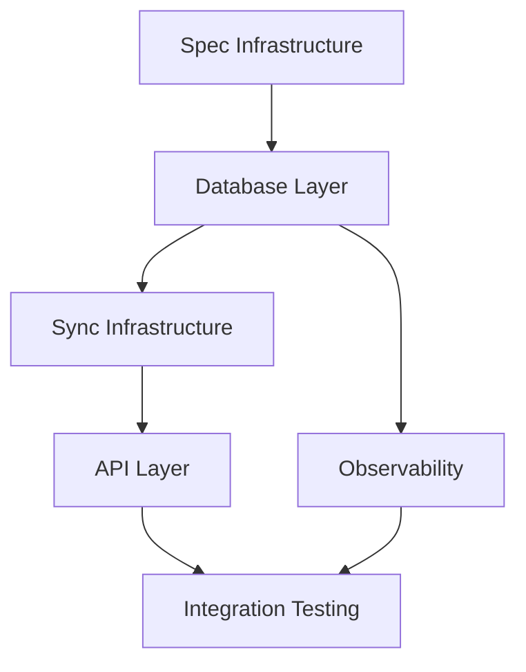

# Plan: Odoo Decoupled Platform

> Implementation plan for the decoupled Odoo + Supabase architecture.

## Phase 1: Foundation (Week 1-2)

### 1.1 Spec Infrastructure
- [x] Create spec/odoo-decoupled-platform/ directory
- [x] Add constitution.md with non-negotiables
- [x] Add prd.md with requirements
- [x] Add plan.md with implementation steps
- [x] Add tasks.md with checklist

### 1.2 Auth Specs
- [x] Create spec/auth/roles.yaml with role definitions
- [ ] Document permission matrix
- [ ] Define SSO integration points

### 1.3 Schema Specs
- [x] Create spec/schema/entities.yaml with ownership mapping
- [ ] Generate DBML from entity spec
- [ ] Add entity relationship documentation

### 1.4 CI Gates
- [x] Add spec-gate workflow for required files
- [ ] Add migration lint workflow
- [ ] Add RLS verification workflow

## Phase 2: Database Layer (Week 2-3)

### 2.1 Core Schemas
- [x] Create app.* schema (app-owned entities)
- [x] Create odoo.* schema (sync tables)
- [ ] Add indexes for common queries

### 2.2 RLS Policies
- [x] Add org-based isolation policies
- [ ] Add role-based access policies
- [ ] Add audit triggers

### 2.3 Odoo Bridge Tables
- [x] Create odoo.instances table
- [x] Create odoo.sync_cursors table
- [ ] Add odoo.webhook_events table
- [ ] Add odoo.entity_mappings table

## Phase 3: Sync Infrastructure (Week 3-4)

### 3.1 Edge Functions
- [ ] Create sync-from-odoo edge function
- [ ] Create sync-to-odoo edge function
- [ ] Create webhook-receiver edge function

### 3.2 Sync Logic
- [ ] Implement cursor-based pagination
- [ ] Implement conflict resolution
- [ ] Implement retry with backoff

### 3.3 Event System
- [ ] Define event schema (Odoo→Supabase)
- [ ] Implement event processor
- [ ] Add dead-letter queue handling

## Phase 4: API Layer (Week 4-5)

### 4.1 API Contracts
- [ ] Generate OpenAPI spec from schema
- [ ] Add API versioning strategy
- [ ] Document rate limits

### 4.2 Type Generation
- [ ] Generate TypeScript types from schema
- [ ] Generate Zod schemas for validation
- [ ] Add to packages/contracts

### 4.3 SDK
- [ ] Create client SDK wrapper
- [ ] Add typed query helpers
- [ ] Document usage patterns

## Phase 5: Observability (Week 5-6)

### 5.1 Ops Schema
- [x] ops.runs for tracking executions
- [x] ops.run_events for detailed logs
- [x] ops.artifacts for outputs

### 5.2 Monitoring
- [ ] Add sync health dashboard
- [ ] Add alert rules for sync failures
- [ ] Add latency tracking

### 5.3 Debugging
- [ ] Add trace correlation IDs
- [ ] Add request/response logging
- [ ] Add sync replay capability

## Phase 6: Integration Testing (Week 6-7)

### 6.1 Test Infrastructure
- [ ] Add test database setup
- [ ] Add mock Odoo server
- [ ] Add integration test suite

### 6.2 Contract Testing
- [ ] Add API contract tests
- [ ] Add RLS policy tests
- [ ] Add sync correctness tests

### 6.3 Performance Testing
- [ ] Add load tests for sync
- [ ] Add latency benchmarks
- [ ] Add capacity planning docs

## Milestones

| Milestone | Description | Status |
|-----------|-------------|--------|
| M1: Spec Complete | All spec files in place | ✅ |
| M2: Schema Ready | Core schemas + RLS deployed | 🔄 |
| M3: Sync Working | Odoo↔Supabase sync operational | ⏳ |
| M4: API Published | Typed API available for apps | ⏳ |
| M5: Production Ready | All gates passing, monitoring active | ⏳ |

## Dependencies

## Risk Mitigation

| Risk | Mitigation |
|------|------------|
| Schema drift | CI gates + migration lint |
| Sync failures | Retry logic + dead-letter queue |
| RLS gaps | Automated RLS tests in CI |
| Auth confusion | Clear spec + training |
| Performance issues | Load testing + capacity planning |
