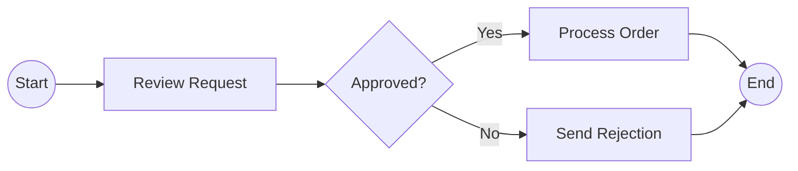

# Diagramflow

Convert Mermaid flowchart diagrams to BPMN 2.0 XML and draw.io format.

## Features

- Parse Mermaid flowchart syntax
- Generate BPMN 2.0 XML (compatible with Camunda, Activiti, etc.)
- Generate draw.io/diagrams.net XML
- Support for common shapes: rectangles, diamonds, circles, stadiums
- Edge labels and styling
- Subgraph support

## Installation

```bash
cd tools/diagramflow
pip install -e .
```

## Usage

### CLI

```bash
# Convert to both BPMN and draw.io
diagramflow input.mmd

# Convert to BPMN only
diagramflow input.mmd -f bpmn

# Convert to draw.io only
diagramflow input.mmd -f drawio

# Specify output directory
diagramflow input.mmd -d output/

# Shortcut commands
mermaid2bpmn input.mmd
mermaid2drawio input.mmd
```

### Python API

```python
from diagramflow import MermaidParser, BPMNGenerator, DrawIOGenerator

# Parse Mermaid
source = """
flowchart TB
    A[Start] --> B{Decision}
    B -->|Yes| C[Action 1]
    B -->|No| D[Action 2]
    C --> E[End]
    D --> E
"""

parser = MermaidParser()
chart = parser.parse(source)

# Generate BPMN
bpmn = BPMNGenerator()
bpmn.save(chart, "output.bpmn")

# Generate draw.io
drawio = DrawIOGenerator()
drawio.save(chart, "output.drawio")
```

## Supported Mermaid Syntax

### Shapes

| Mermaid | Shape | BPMN |
|---------|-------|------|
| `[text]` | Rectangle | Task |
| `{text}` | Diamond | Gateway |
| `((text))` | Circle | Event |
| `(text)` | Stadium | Task |
| `[[text]]` | Subroutine | SubProcess |

### Edges

| Mermaid | Description |
|---------|-------------|
| `-->` | Solid arrow |
| `-.->` | Dotted arrow |
| `-->|label|` | Arrow with label |
| `---` | Line (no arrow) |

### Direction

- `TB` - Top to bottom (default)
- `BT` - Bottom to top
- `LR` - Left to right
- `RL` - Right to left

## Example

Input (`process.mmd`):



Output files:
- `process.bpmn` - BPMN 2.0 XML
- `process.drawio` - draw.io XML

## Integration with ipai-gen

The diagramflow tool integrates with the IPAI module generator:

1. Place Mermaid diagrams in `docs/diagrams/*.mmd`
2. Run `diagramflow docs/diagrams/*.mmd -d docs/diagrams/`
3. Run `ipai-gen` to update wiki diagram references

## Dependencies

- Python 3.10+
- lxml (for XML generation)
- PyYAML (for configuration)

## License

LGPL-3.0
