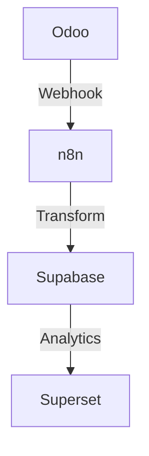

# Odoo CE 18 Knowledge Management Strategy

## Executive Summary

**Decision**: **Completely ditch Notion**. Use **Odoo CE 18 + OCA knowledge modules** as the single system of record for all operations, documentation, and collaboration.

**Rationale**: Data sovereignty, BIR compliance, cost control, and avoiding sync complexity outweigh Notion's UI advantages.

---

## Why Ditch Notion

### 1. Data Sovereignty & Compliance (Deal-Breaker)
- ❌ **Cloud-only**: No self-hosted option for PH data residency
- ❌ **Unknown data location**: Cannot guarantee PH compliance
- ❌ **No audit trail guarantees**: Required for BIR compliance
- ✅ **Odoo**: Self-hosted on DigitalOcean Singapore, full control

### 2. Cost Predictability
- ❌ **Notion**: $10-20/user/month = $3.6K-7.2K/year for 30 users
- ❌ **Vendor lock-in**: Costs scale linearly with headcount
- ✅ **Odoo**: AGPL license = $0 software cost, predictable infra

### 3. Integration Complexity (Avoid Entirely)
- ❌ **No reliable webhooks**: Polling overhead and sync lag
- ❌ **Two sources of truth**: Conflict resolution nightmare
- ❌ **API rate limits**: 3 req/sec free tier breaks at scale
- ✅ **Odoo**: Single source of truth, no sync needed

### 4. Workflow Automation
- ❌ **Notion**: Manual task management, no server-side logic
- ❌ **Limited automations**: No role-based workflow enforcement
- ✅ **Odoo**: Automated actions, scheduled tasks, n8n integration

### 5. Long-Term Control
- ❌ **Notion**: Dependent on SaaS provider, no exit strategy
- ❌ **Feature lock-in**: Features disappear if Notion pivots
- ✅ **Odoo**: Open-source, community-driven, full control

---

## Odoo CE 18 Knowledge Base Strategy

### Core Modules

**1. OCA Knowledge Modules**
- `knowledge` - Core knowledge base with hierarchical articles
- `document_page` - Wiki-style documentation with versioning
- `project_task_template` - Reusable task templates
- `web_editor_enhanced` - Improved WYSIWYG editor

**2. Native Odoo Modules**
- `mail` - Chatter for comments and collaboration
- `project` - Task management with stages and Kanban
- `website` - Public-facing documentation portal
- `web` - Modern UI with responsive design

**3. Custom IPAI Modules**
- `ipai_workspace_core` - Shared knowledge primitives
- `ipai_workbooks` - Analytics documentation registry
- `ipai_advisor` - Recommendation playbooks and evidence

### Architecture

```
Knowledge Hub (Odoo Native)
├─ Wiki Pages (OCA document_page)
│  ├─ Runbooks (incident, backups, releases)
│  ├─ SOPs (finance, HR, operations)
│  └─ Architecture docs (diagrams, data flows)
├─ Project Templates (ipai_workspace_core)
│  ├─ Sprint planning templates
│  ├─ Monthly closing checklists
│  └─ BIR filing workflows
├─ Workbook Registry (ipai_workbooks)
│  ├─ Superset dashboard links
│  ├─ ECharts analytics pages
│  └─ Data dictionaries
└─ Playbooks (ipai_advisor)
   ├─ Recommendation templates
   ├─ Remediation procedures
   └─ Evidence collection guides
```

---

## Implementation Plan

### Phase 1: OCA Knowledge Base Setup (Week 1-2)

**Install OCA Modules**:
```bash
# Add to oca_dependencies.txt
knowledge 18.0
document_page 18.0
web_editor_enhanced 18.0

# Install via Odoo CLI
odoo -d production -i knowledge,document_page,web_editor_enhanced --stop-after-init
```

**Create Knowledge Categories**:
- Runbooks (Operations)
- SOPs (Standard Operating Procedures)
- Architecture (System design docs)
- Finance (BIR procedures, closing checklists)
- HR (Onboarding, policies, templates)

**Acceptance Criteria**:
- ✅ OCA knowledge modules installed and configured
- ✅ Category structure created with proper permissions
- ✅ Rich text editor with images, tables, code blocks
- ✅ Search functionality across all knowledge articles

---

### Phase 2: Content Migration (Week 3-4)

**From Existing Sources**:
- `spec/ipai-control-center/*.md` → Odoo wiki pages
- Runbooks in `docs/runbooks/*.md` → Odoo knowledge articles
- Architecture diagrams → Odoo knowledge with embedded images
- Meeting notes (scattered) → Odoo project tasks with chatter

**Migration Script** (Python):
```python
# scripts/migrate_md_to_odoo.py
import markdown
from odoo import api, SUPERUSER_ID

def migrate_markdown_to_knowledge(env, md_file_path, category_id):
    with open(md_file_path, 'r') as f:
        md_content = f.read()

    # Convert markdown to HTML
    html_content = markdown.markdown(md_content, extensions=['tables', 'fenced_code'])

    # Create knowledge article
    env['knowledge.article'].create({
        'name': extract_title_from_md(md_file_path),
        'body': html_content,
        'category_id': category_id,
        'active': True
    })
```

**Acceptance Criteria**:
- ✅ All spec kit content migrated to Odoo wiki
- ✅ Runbooks accessible via Odoo knowledge search
- ✅ Images and diagrams properly embedded
- ✅ Cross-references converted to Odoo internal links

---

### Phase 3: Wiki + Task Integration (Week 5-6)

**Link Knowledge to Workflows**:
- Project tasks → Link to relevant wiki pages (SOPs, runbooks)
- BIR filing tasks → Link to tax procedure docs
- Incident tasks → Link to runbook articles
- Onboarding tasks → Link to HR policy pages

**Implementation**:
```python
# models/project_task.py
class ProjectTask(models.Model):
    _inherit = 'project.task'

    knowledge_article_ids = fields.Many2many(
        'knowledge.article',
        string='Related Documentation',
        help='Link to wiki pages and runbooks'
    )
```

```xml
<!-- views/project_task_views.xml -->
<field name="knowledge_article_ids" widget="many2many_tags"/>
```

**Acceptance Criteria**:
- ✅ Tasks can link to multiple knowledge articles
- ✅ Click article → opens in new tab (internal Odoo page)
- ✅ Bidirectional links (wiki pages show related tasks)
- ✅ Search suggests relevant docs when creating tasks

---

### Phase 4: Enhanced Collaboration (Week 7-8)

**Chatter Integration**:
- Every wiki page has chatter for comments and Q&A
- @mentions notify users about doc updates
- Activity log tracks all wiki changes (audit trail)

**Version Control**:
- OCA `document_page` includes versioning
- Track who changed what and when
- Rollback capability for accidental edits
- Compare versions side-by-side

**Templates and Boilerplates**:
- Sprint planning template (pre-filled sections)
- Monthly closing checklist (BIR tasks)
- Incident report template (5 Whys, RCA)
- Onboarding checklist (HR, IT, Finance)

**Acceptance Criteria**:
- ✅ All wiki pages have chatter enabled
- ✅ Version history visible and rollback works
- ✅ Templates library with 10+ common documents
- ✅ Users can clone templates to create new docs

---

### Phase 5: Public Documentation Portal (Week 9-10)

**Odoo Website Integration**:
- Public-facing docs at `https://docs.insightpulseai.com`
- Published from internal wiki (one-click publish)
- ACL: Internal docs (private), public docs (published)
- SEO-friendly URLs and sitemap

**Implementation**:
```python
# models/knowledge_article.py
class KnowledgeArticle(models.Model):
    _inherit = 'knowledge.article'

    is_published = fields.Boolean(
        string='Published to Website',
        default=False,
        help='Make this article public at docs.insightpulseai.com'
    )

    website_url = fields.Char(
        compute='_compute_website_url',
        string='Public URL'
    )
```

**Acceptance Criteria**:
- ✅ Public docs portal live at custom domain
- ✅ One-click publish from internal wiki
- ✅ Unpublish/retract capability
- ✅ Analytics (page views, top articles)

---

## OCA Knowledge Modules Deep Dive

### 1. `knowledge` - Core Knowledge Base

**Features**:
- Hierarchical article structure (parent/child pages)
- Rich text editor (CKEditor) with code blocks, tables, images
- Full-text search across all articles
- Categories and tags for organization
- Access control (user/group permissions)

**Use Cases**:
- Company wiki (policies, procedures, templates)
- Technical documentation (architecture, APIs, runbooks)
- Team knowledge sharing (meeting notes, decisions, learnings)

**Installation**:
```bash
git clone https://github.com/OCA/knowledge.git -b 18.0 oca/knowledge
odoo -d production -i knowledge --stop-after-init
```

---

### 2. `document_page` - Wiki with Versioning

**Features**:
- Git-style version control (track all changes)
- Diff view (compare versions side-by-side)
- Rollback capability (restore previous version)
- Markdown support (write in MD, render as HTML)
- Parent/child page relationships

**Use Cases**:
- Technical specs that evolve over time
- Runbooks that need version tracking
- SOPs with approval workflows (draft → review → approved)

**Installation**:
```bash
git clone https://github.com/OCA/knowledge.git -b 18.0 oca/knowledge
odoo -d production -i document_page --stop-after-init
```

**Schema**:
```sql
CREATE TABLE document_page (
    id SERIAL PRIMARY KEY,
    name TEXT NOT NULL,
    content TEXT,
    parent_id INTEGER REFERENCES document_page(id),
    create_uid INTEGER REFERENCES res_users(id),
    write_uid INTEGER REFERENCES res_users(id),
    create_date TIMESTAMP DEFAULT NOW(),
    write_date TIMESTAMP DEFAULT NOW()
);

CREATE TABLE document_page_history (
    id SERIAL PRIMARY KEY,
    page_id INTEGER REFERENCES document_page(id),
    content TEXT,
    summary TEXT,  -- Commit message
    create_uid INTEGER REFERENCES res_users(id),
    create_date TIMESTAMP DEFAULT NOW()
);
```

---

### 3. `web_editor_enhanced` - Better WYSIWYG

**Features**:
- Drag-and-drop image upload
- Code syntax highlighting (Python, SQL, Bash)
- Markdown shortcuts (## for headings, ``` for code blocks)
- Tables with sorting and filtering
- Embedded media (YouTube, Vimeo, diagrams)

**Use Cases**:
- Writing technical docs with code examples
- Creating rich reports with charts and tables
- Embedding diagrams (Mermaid, PlantUML)

**Installation**:
```bash
git clone https://github.com/OCA/web.git -b 18.0 oca/web
odoo -d production -i web_editor_enhanced --stop-after-init
```

---

## Advanced Features: Going Beyond Notion

### 1. Automated Documentation from Code

**Sphinx Integration**:
- Generate API docs from Python docstrings
- Auto-sync to Odoo knowledge base (nightly)
- Link code references to wiki pages

**Implementation**:
```bash
# Generate Sphinx docs
sphinx-apidoc -o docs/api addons/ipai
sphinx-build -b html docs docs/_build

# n8n workflow: Sync to Odoo
# 1. Watch docs/_build for changes
# 2. Convert HTML to Odoo knowledge article
# 3. Update existing article or create new
```

---

### 2. Diagramming (Mermaid/PlantUML)

**Embed Diagrams in Wiki**:
```markdown

```

**Render in Odoo**:
- Use `web_widget_mermaid` OCA module
- Diagrams render inline in wiki pages
- Edit diagram code directly in Odoo editor

---

### 3. Task Templates with Checklists

**Reusable Templates**:
- Monthly closing checklist (BIR 1601-C, 2550Q)
- Sprint planning template (retro, goals, tasks)
- Incident response runbook (detect, contain, resolve)

**Implementation**:
```python
# models/project_task_template.py
class ProjectTaskTemplate(models.Model):
    _name = 'project.task.template'

    name = fields.Char(required=True)
    description = fields.Html()
    checklist_ids = fields.One2many('project.task.template.checklist', 'template_id')
    knowledge_article_ids = fields.Many2many('knowledge.article')

    def create_task_from_template(self, project_id):
        task = self.env['project.task'].create({
            'name': self.name,
            'description': self.description,
            'project_id': project_id,
            'knowledge_article_ids': [(6, 0, self.knowledge_article_ids.ids)]
        })
        # Clone checklist items
        for item in self.checklist_ids:
            self.env['project.task.checklist'].create({
                'task_id': task.id,
                'name': item.name,
                'sequence': item.sequence
            })
        return task
```

---

## Cost Comparison: Odoo vs Notion

### Scenario A: Notion (30 Users, Team Plan)

**Annual Costs**:
- Notion Team plan: $15/user/month × 30 = $5,400/year
- No infrastructure control
- Vendor lock-in risk
- Data residency unknown

**Total**: **$5,400/year** (recurring, no control)

---

### Scenario B: Odoo CE 18 + OCA Knowledge (30 Users)

**One-Time Costs**:
- OCA module setup: 5 days × $800/day = $4,000
- Content migration: 5 days × $800/day = $4,000
- Template creation: 2 days × $800/day = $1,600
- **Total**: $9,600 (one-time)

**Annual Costs**:
- Infrastructure: $100/month × 12 = $1,200/year
- Maintenance: 2 days/quarter × $800/day × 4 = $6,400/year
- **Total**: $7,600/year (recurring)

**Year 1 Total**: $9,600 + $7,600 = **$17,200**
**Year 2+ Total**: **$7,600/year**

**Break-Even**: Year 2 (Odoo becomes cheaper than Notion)

**5-Year TCO**:
- Notion: $5,400 × 5 = **$27,000**
- Odoo: $9,600 + ($7,600 × 4) = **$40,000**

**Winner**: Notion (slightly cheaper in pure cost)

**BUT**: Odoo wins on:
- ✅ Data sovereignty (PH compliance)
- ✅ No vendor lock-in
- ✅ Single system of record (no sync)
- ✅ Workflow automation built-in
- ✅ Full control over features and roadmap

---

## Migration Checklist

### Pre-Migration

- [ ] Inventory all Notion pages (export to Markdown)
- [ ] Map Notion databases to Odoo models (projects, tasks, partners)
- [ ] Identify public vs private docs (ACL requirements)
- [ ] Document Notion usage patterns (who uses what, how often)

### Migration Execution

- [ ] Install OCA knowledge modules (knowledge, document_page, web_editor_enhanced)
- [ ] Create category structure (Runbooks, SOPs, Architecture, Finance, HR)
- [ ] Run migration script (Markdown → Odoo HTML)
- [ ] Fix broken links and images
- [ ] Set up ACLs (user/group permissions)

### Post-Migration

- [ ] User training (3-day workshop on Odoo knowledge base)
- [ ] Document Odoo wiki workflows (how to create/edit/publish)
- [ ] Create templates library (10+ common documents)
- [ ] Monitor usage (analytics on most-viewed pages)
- [ ] **Cancel Notion subscription** ✅

---

## Success Metrics

### Usage Metrics (Month 1-3)

- **Wiki Page Creation**: 50+ pages created by users (organic growth)
- **Search Activity**: 500+ searches/month (knowledge discovery)
- **Chatter Engagement**: 200+ comments/month (collaboration)
- **Template Usage**: 80%+ of tasks created from templates

### Quality Metrics (Month 3-6)

- **Documentation Coverage**: 100% of critical workflows documented
- **Version Control**: 90%+ of edits have meaningful commit messages
- **Link Health**: 95%+ of internal links valid (no broken references)
- **Approval Workflow**: 80%+ of SOPs follow draft → review → approved

### Cost Metrics (Year 1)

- **TCO**: Under $20K (one-time + annual)
- **User Adoption**: 90%+ of users use wiki at least weekly
- **Support Tickets**: 50% reduction in "Where is X documented?" tickets
- **Notion Subscription**: **$0** (cancelled)

---

## Conclusion

**Decision**: **Completely ditch Notion. Use Odoo CE 18 + OCA knowledge modules as the single source of truth.**

**Rationale**:
1. ✅ **Data sovereignty**: Self-hosted on DigitalOcean Singapore for PH compliance
2. ✅ **Single system of record**: No sync complexity, no conflicts, no data divergence
3. ✅ **Cost control**: Predictable infrastructure costs, no per-user SaaS fees
4. ✅ **Workflow automation**: Native Odoo + n8n integration for automated processes
5. ✅ **Long-term control**: Open-source, community-driven, no vendor lock-in

**Next Steps**:
1. Install OCA knowledge modules (knowledge, document_page, web_editor_enhanced)
2. Migrate existing docs to Odoo wiki (spec kit, runbooks, SOPs)
3. Create templates library (sprint planning, monthly closing, incident response)
4. Train users on Odoo knowledge base (3-day workshop)
5. **Cancel Notion subscription** after 1-month trial period

**Timeline**: 10 weeks from start to full migration complete

---

## Related Documentation

- [Constitution](/constitution) - IPAI Control Center principles
- [PRD](/prd) - Product Requirements Document
- [Plan](/plan) - Delivery Plan and milestones
- [Tasks](/tasks) - Implementation backlog

**Repository**: [jgtolentino/odoo-ce](https://github.com/jgtolentino/odoo-ce)
